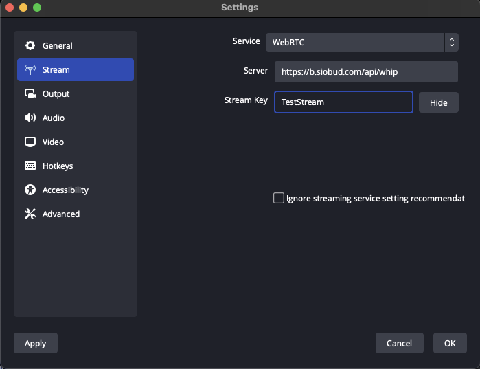
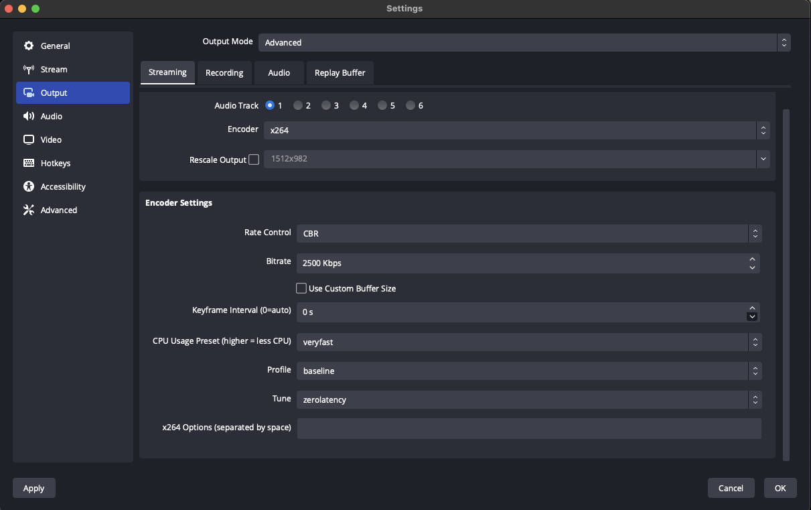

# Broadcast Box

[](https://opensource.org/licenses/MIT)
[](https://discord.gg/An5jjhNUE3)

- [What is Broadcast Box](#what-is-broadcast-box)
- [Using](#using)
    + [Broadcasting](#broadcasting)
    + [Broadcasting (Gstreamer, CLI)](#broadcasting--gstreamer--cli-)
    + [Playback](#playback)
- [Building](#building)
    + [Installing Dependencies](#installing-dependencies)
    + [Configuring](#configuring)
    + [Local Development](#local-development)
    + [Production](#production)
- [Running](#running)
-   + [Network Test on Start](#network-test-on-start)
    + [Environment variables](#environment-variables)
    + [Docker](#docker)
    + [Docker Compose](#docker-compose)
- [Design](#design)

## What is Broadcast Box
Broadcast Box lets you broadcast to others in sub-second time. It was designed
to be simple to use and easily modifiable. We wrote Broadcast Box to show off some
of the cutting edge tech that is coming to the broadcast space.

### Sub-second Latency
Broadcast Box uses WebRTC for broadcast and playback. By using WebRTC instead of
RTMP and HLS you get the fastest experience possible.

### Latest in Video Compression
With WebRTC you get access to the latest in video codecs. With AV1 you can send
the same video quality with a [50%](https://engineering.fb.com/2018/04/10/video-engineering/av1-beats-x264-and-libvpx-vp9-in-practical-use-case/)
reduction in bandwidth required.

### Broadcast all angles
WebRTC allows you to upload multiple video streams in the same session. Now you can
broadcast multiple camera angles, or share interactive video experiences in real time!

### Broadcasters provide transcodes
Transcodes are necessary if you want to provide a good experience to all your users.
Generating them is prohibitively expensive though, WebRTC provides a solution. With WebRTC
users can upload the same video at different quality levels. This
keeps things cheap for the server operator and you still can provide the same
experience.

### Peer-to-Peer (if you need it)
With Broadcast Box you can serve your video without a public IP or forwarding ports!

Run Broadcast Box on the same machine that you are running OBS, and share your
video with the world! WebRTC comes with P2P technology, so users can broadcast
and playback video without paying for dedicated servers. To start the connection users will
need to be able to connect to the HTTP server. After they have negotiated the session then
NAT traversal begins.

You could also use P2P to pull other broadcasters into your stream. No special configuration
or servers required anymore to get sub-second co-streams.

Broadcast Box acts as a [SFU](https://webrtcforthecurious.com/docs/08-applied-webrtc/#selective-forwarding-unit). This means that
every client connects to Broadcast Box. No direct connection is established between broadcasters/viewers.
If you want a direct connection between OBS and your browser see [OBS2Browser](https://github.com/Sean-Der/OBS2Browser).

# Using
To use Broadcast Box you don't even have to run it locally! A instance of Broadcast Box
is hosted at [b.siobud.com](https://b.siobud.com). If you wish to run it locally skip to
[Running](#running)

### Broadcasting
To use Broadcast Box with OBS you must set your output to WebRTC and set a proper URL + Stream Key.
You may use any Stream Key you like. The same stream key is used for broadcasting and playback.

Go to `Settings -> Stream` and set the following values.

* Service: WebRTC
* Server: https://b.siobud.com/api/whip
* StreamKey: (Any Stream Key you like)

Your settings page should look like this.



OBS by default will have ~2 seconds of latency. If you want sub-second latency you can configure
this in `Settings -> Output`. Set your encoder to `x264` and set tune to `zerolatency`. Your Output
page will look like this.



When you are ready to broadcast press `Stream Streaming` and now time to watch!

### Broadcasting (GStreamer, CLI)

See the example script(s):
  * `examples/gstreamer-broadcast.nu`
    * can broadcast gstreamer's test sources, or pulsesrc+v4l2src
    * expects `gstreamer-1.0`, with `good,bad,ugly` plugins and `gst-plugins-rs`
    * ```shell
      # testsrcs
      ./examples/gstreamer-broadcast.nu http://localhost:8080/api/whip testStream1
      # v4l2src
      ./examples/gstreamer-broadcast.nu http://localhost:8080/api/whip testStream1 v4l2
      ```

### Playback

If you are broadcasting to the Stream Key `StreamTest` your video will be available at https://b.siobud.com/StreamTest.

You can also go to the home page and enter `StreamTest`. The following is a screenshot of OBS broadcasting and
the latency of 120 milliseconds observed.


# Building
Broadcast Box is made up of two parts. The server is written in Go and is in charge
of ingesting and broadcasting WebRTC. The frontend is in react and connects to the Go
backend.

While developing `webpack-dev-server` is used for the frontend. In production the Go server
can be used to serve the HTML/CSS/JS directly. These are the instructions on how to run all
these parts.

### Installing Dependencies
Go dependencies are automatically installed.

react dependencies are installed by running `npm install` in the `web` directory.

### Configuring
Both projects use `.env` files for configuration. For development `.env.development` is used
and in production `.env.production` is used.

For Go setting `APP_ENV` will cause `.env.production` to be loaded.
Otherwise `.env.development` is used.

For react App the dev server uses `.env.development` and `npm run build`
uses `.env.production`

### Local Development
For local development you will run the Go server and webpack directly.

To run the Go server run `go run .` in the root of this project. You will see the logs
like the following.

```
2022/12/11 15:22:47 Loading `.env.development`
2022/12/11 15:22:47 Running HTTP Server at `:8080`
```

To run the web front open the `web` folder and execute `npm start` if that runs successfully you will
be greeted with.

```
Compiled successfully!

You can now view broadcast-box in the browser.

  Local:            http://localhost:3000
  On Your Network:  http://192.168.1.57:3000

Note that the development build is not optimized.
To create a production build, use npm run build.

webpack compiled successfully
```

To use Broadcast Box you will open `http://localhost:3000` in your browser. In your broadcast tool of choice
you will broadcast to `http://localhost:8080/api/whip`.

### Production Build
For production usage Go will server the frontend and backend.

To run the Go server run `APP_ENV=production go run .` in the root of this project. You will see the logs
like the following.

```
2022/12/11 16:02:14 Loading `.env.production`
2022/12/11 16:02:14 Running HTTP Server at `:8080`
```

If `APP_ENV` was set properly `.env.production` will be loaded.

To build the frontend execute `npm run build` in the `web` directory. You will get the following output.

```
> broadcast-box@0.1.0 build
> dotenv -e ../.env.production react-scripts build

Creating an optimized production build...
Compiled successfully.

File sizes after gzip:

  53.51 kB  build/static/js/main.12067218.js
  2.27 kB   build/static/css/main.8738ee38.css
```

To use Broadcast Box you will open `http://localhost:8080` in your browser. In your broadcast tool of choice
you will broadcast to `http://localhost:8080/api/whip`.

## Running

### Environment Variables
The backend can be configured with the following environment variables.

* `DISABLE_STATUS` - Disable the status API
* `ENABLE_HTTP_REDIRECT` - HTTP traffic will be redirect to HTTPS
* `HTTP_ADDRESS` - HTTP Server Address
* `INCLUDE_PUBLIC_IP_IN_NAT_1_TO_1_IP` - Like `NAT_1_TO_1_IP` but autoconfigured
* `INTERFACE_FILTER` - Only use a certain interface for UDP traffic
* `NAT_1_TO_1_IP` - If behind a NAT use this to auto insert your public IP
* `NETWORK_TEST_ON_START` - When "true" on startup Broadcast Box will check network connectivity
* `SSL_CERT` - Path to SSL certificate if using Broadcast Box's HTTP Server
* `SSL_KEY` - Path to SSL key if using Broadcast Box's HTTP Server
- `STUN_SERVERS` - List of STUN servers delineated by '|'. Useful if Broadcast Box is running behind a NAT
* `TCP_MUX_ADDRESS` - If you wish to make WebRTC traffic available via TCP.
* `UDP_MUX_PORT_WHEP` - Like `UDP_MUX_PORT` but only for WHEP traffic
* `UDP_MUX_PORT_WHIP` - Like `UDP_MUX_PORT` but only for WHIP traffic
* `UDP_MUX_PORT` - Serve all UDP traffic via one port. By default Broadcast Box listens on a random port

## Network Test on Start

When running in Docker Broadcast Box runs a network tests on startup. This tests that WebRTC traffic can be established
against your server. If you server is misconfigured Broadcast Box will not start.

If the network test is enabled this will be printed on startup

```
NETWORK_TEST_ON_START is enabled. If the test fails Broadcast Box will exit.
See the README.md for how to debug or disable NETWORK_TEST_ON_START
```

If the test passed you will see

```
Network Test passed.
Have fun using Broadcast Box
```

If the test failed you will see the following. The middle sentence will change depending on the error.

```
Network Test failed.
Network Test client reported nothing in 30 seconds
Please see the README and join Discord for help
```

Join the Discord and we are ready to help! To debug check the following.

* Have you allowed UDP traffic?
* Do you have any restrictions on ports?
* Is your server publicly accessible?

If you wish to disable the test set the environment variable `NETWORK_TEST_ON_START` to false.

### Docker
A Docker image is also provided to make it easier to run locally and in production. The arguments you run the Dockerfile with depending on
if you are using it locally or a server.

If you want to run locally execute `docker run -e UDP_MUX_PORT=8080 -e NAT_1_TO_1_IP=127.0.0.1 -p 8080:8080 -p 8080:8080/udp seaduboi/broadcast-box`.
This will make broadcast-box available on `http://localhost:8080`. The UDPMux is needed because Docker on macOS/Windows runs inside a NAT.

If you are running on AWS (or other cloud providers) execute. `docker run --net=host -e INCLUDE_PUBLIC_IP_IN_NAT_1_TO_1_IP=yes seaduboi/broadcast-box`
broadcast-box needs to be run in net=host mode. broadcast-box listens on random UDP ports to establish sessions.

### Docker Compose

A Docker Compose is included that uses LetsEncrypt for automated HTTPS. It also includes Watchtower so your instance of Broadcast Box
will be automatically updated every night. If you are running on a VPS/Cloud server this is the quickest/easiest way to get started.

```
export URL=my-server.com
docker-compose up -d
```

# Design
The backend exposes three endpoints (the status page is optional, if hosting locally).

- `/api/whip` - Start a WHIP Session. WHIP broadcasts video via WebRTC.
* `/api/whep` - Start a WHEP Session. WHEP is video playback via WebRTC.
* `/api/status` - Status of the all active WHIP streams
