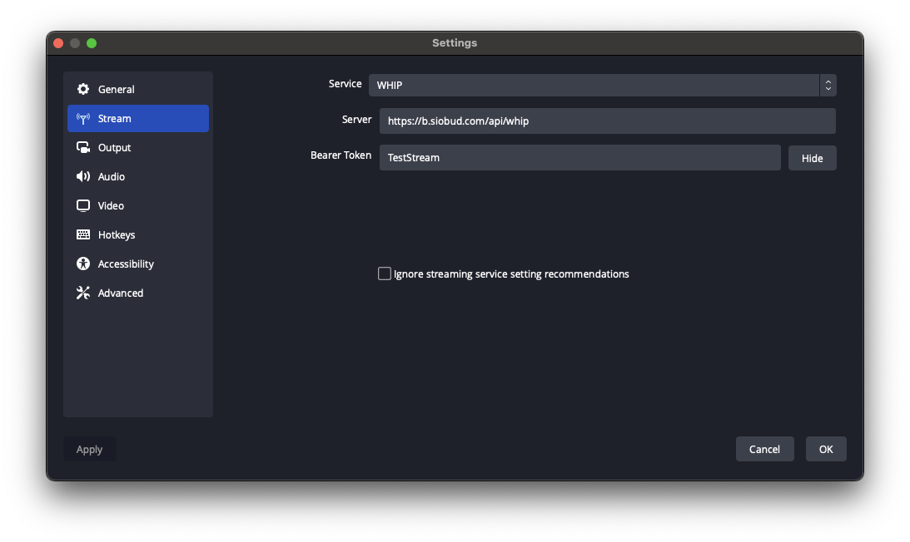
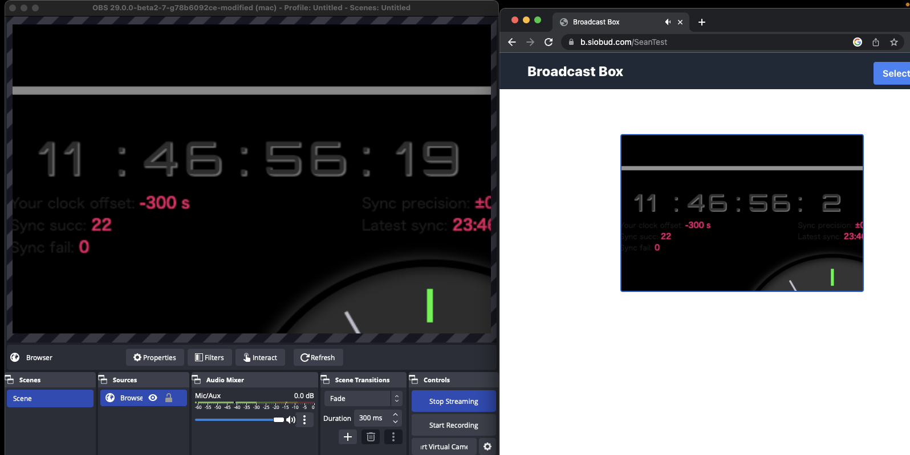

# Broadcast Box

[![License][license-image]][license-url]
[![Discord][discord-image]][discord-invite-url]

- [What is Broadcast Box](#what-is-broadcast-box)
- [Using](#using)
  - [Broadcasting](#broadcasting)
  - [Broadcasting (GStreamer, CLI)](#broadcasting-gstreamer-cli)
  - [Playback](#playback)
- [Getting Started](#getting-started)
  - [Configuring](#configuring)
  - [Building From Source](#building-from-source)
  - [Frontend](#frontend)
  - [Backend](#backend)
  - [Docker](#docker)
  - [Docker Compose](#docker-compose)
  - [Environment variables](#environment-variables)
  - [Webhook - Authentication and Logging](#webhook---authentication-and-logging)
  - [Network Test on Start](#network-test-on-start)
- [Design](#design)

## What is Broadcast Box

Broadcast Box lets you broadcast to others in sub-second time. It was designed
to be simple to use and easily modifiable. We wrote Broadcast Box to show off some
of the cutting edge tech that is coming to the broadcast space.

Want to contribute to the development of Broadcast Box? See [Contributing](./CONTRIBUTING.md).

### Sub-second Latency

Broadcast Box uses WebRTC for broadcast and playback. By using WebRTC instead of
RTMP and HLS you get the fastest experience possible.

### Latest in Video Compression

With WebRTC you get access to the latest in video codecs. With AV1 you can send
the same video quality with a [50%][av1-practical-use-case] reduction in bandwidth required.

[av1-practical-use-case]: https://engineering.fb.com/2018/04/10/video-engineering/av1-beats-x264-and-libvpx-vp9-in-practical-use-case/

### Broadcast all angles

WebRTC allows you to upload multiple video streams in the same session. Now you can
broadcast multiple camera angles, or share interactive video experiences in real time!

### Broadcasters provide transcodes

Transcodes are necessary if you want to provide a good experience to all your users.
Generating them is prohibitively expensive though, WebRTC provides a solution. With WebRTC
users can upload the same video at different quality levels. This
keeps things cheap for the server operator and you still can provide the same
experience.

### Broadcasting for all

WebRTC means anyone can be a broadcaster. With Broadcast Box you could use broadcast software like OBS.
However, another option is publishing directly from your browser! Users just getting started with streaming
don't need to worry about bitrates, codecs anymore. With one press of a button you can go live right from
your browser with Broadcast Box. This makes live-streaming accessible to an entirely new audience.

### Peer-to-Peer (if you need it)

With Broadcast Box you can serve your video without a public IP or forwarding ports!

Run Broadcast Box on the same machine that you are running OBS, and share your
video with the world! WebRTC comes with P2P technology, so users can broadcast
and playback video without paying for dedicated servers. To start the connection users will
need to be able to connect to the HTTP server. After they have negotiated the session then
NAT traversal begins.

You could also use P2P to pull other broadcasters into your stream. No special configuration
or servers required anymore to get sub-second co-streams.

Broadcast Box acts as a [SFU][applied-webrtc-article]. This means that
every client connects to Broadcast Box. No direct connection is established between broadcasters/viewers.
If you want a direct connection between OBS and your browser see [OBS2Browser][obs-2-browser-repo].

[applied-webrtc-article]: https://webrtcforthecurious.com/docs/08-applied-webrtc/#selective-forwarding-unit
[obs-2-browser-repo]: https://github.com/Sean-Der/OBS2Browser

## Using

To use Broadcast Box you don't even have to run it locally! A instance of Broadcast Box
is hosted at [b.siobud.com](https://b.siobud.com). If you wish to run it locally skip to [Getting Started](#getting-started)

### Broadcasting

To use Broadcast Box with OBS you must set your output to WebRTC and set a proper URL + Stream Key.
You may use any Stream Key you like. The same stream key is used for broadcasting and playback.

Go to `Settings -> Stream` and set the following values.

- Service: WHIP
- Server: <https://b.siobud.com/api/whip>
- StreamKey: (Any Stream Key you like)

Your settings page should look like this:



OBS by default will have ~2 seconds of latency. If you want sub-second latency you can configure
this in `Settings -> Output`. Set your encoder to `x264` and set tune to `zerolatency`. Your Output
page will look like this.


When you are ready to broadcast press `Start Streaming` and now time to watch!

### Broadcasting (GStreamer, CLI)

See the example script [here](examples/gstreamer-broadcast.nu).

Can broadcast gstreamer's test sources, or pulsesrc+v4l2src

Expects `gstreamer-1.0`, with `good,bad,ugly` plugins and `gst-plugins-rs`

Use of example scripts:

```shell
# testsrcs
./examples/gstreamer-broadcast.nu http://localhost:8080/api/whip testStream1
# v4l2src
./examples/gstreamer-broadcast.nu http://localhost:8080/api/whip testStream1 v4l2
```

### Playback

If you are broadcasting to the Stream Key `StreamTest` your video will be available at <https://b.siobud.com/StreamTest>.

You can also go to the home page and enter `StreamTest`. The following is a screenshot of OBS broadcasting and
the latency of 120 milliseconds observed.



## Getting Started

Broadcast Box is made up of two parts. The server is written in Go and is in charge of ingesting and broadcasting WebRTC. The frontend is in react and connects to the Go backend. The Go server can be used to serve the HTML/CSS/JS directly. Use the following instructions to build from source or utilize [Docker](#docker) / [Docker Compose](#docker-compose).

### Configuring

Configurations can be made in [.env.production](./.env.production), although the defaults should get things going.

### Building From Source

#### Frontend

React dependencies are installed by running `npm install` in the `web` directory and `npm run build` will build the frontend.

If everything is successful, you should see the following:

```console
> broadcast-box@0.1.0 build
> dotenv -e ../.env.production react-scripts build

Creating an optimized production build...
Compiled successfully.

File sizes after gzip:

  53.51 kB  build/static/js/main.12067218.js
  2.27 kB   build/static/css/main.8738ee38.css
...
```

#### Backend

Go dependencies are automatically installed.

To run the Go server, run `go run .` in the root of this project, you should see the following:

```console
2022/12/11 16:02:14 Loading `.env.production`
2022/12/11 16:02:14 Running HTTP Server at `:8080`
```

To use Broadcast Box navigate to: `http://<YOUR_IP>:8080`. In your broadcast tool of choice, you will broadcast to `http://<YOUR_IP>:8080/api/whip`.

### Docker

A Docker image is also provided to make it easier to run locally and in production. The arguments you run the Dockerfile with depending on
if you are using it locally or a server.

If you want to run locally execute `docker run -e UDP_MUX_PORT=8080 -e NAT_1_TO_1_IP=127.0.0.1 -p 8080:8080 -p 8080:8080/udp seaduboi/broadcast-box`.
This will make broadcast-box available on `http://localhost:8080`. The UDPMux is needed because Docker on macOS/Windows runs inside a NAT.

If you are running on AWS (or other cloud providers) execute. `docker run --net=host -e INCLUDE_PUBLIC_IP_IN_NAT_1_TO_1_IP=yes seaduboi/broadcast-box`
broadcast-box needs to be run in net=host mode. broadcast-box listens on random UDP ports to establish sessions.

### Docker Compose

A Docker Compose is included that uses LetsEncrypt for automated HTTPS. It also includes Watchtower so your instance of Broadcast Box
will be automatically updated every night. If you are running on a VPS/Cloud server this is the quickest/easiest way to get started.

```console
export URL=my-server.com
docker-compose up -d
```

## URL Parameters

The frontend can be configured by passing these URL Parameters.

- `cinemaMode=true` - Forces the player into cinema mode by adding to end of URL like https://b.siobud.com/myStream?cinemaMode=true

## Environment Variables

### Server Configuration

| Variable                | Description                                              |
| ----------------------- | -------------------------------------------------------- |
| `HTTP_ADDRESS`          | Address for the HTTP server to bind to.                  |
| `ENABLE_HTTP_REDIRECT`  | Enables automatic redirection from HTTP to HTTPS.        |
| `HTTPS_REDIRECT_PORT`   | Port to redirect HTTP traffic to HTTPS when using HTTPS. |
| `NETWORK_TEST_ON_START` | If "true", checks network connectivity on startup.       |
| `DISABLE_STATUS`        | Disables the status API endpoint.                        |

### SSL Configuration

| Variable   | Description                       |
| ---------- | --------------------------------- |
| `SSL_CERT` | Path to the SSL certificate file. |
| `SSL_KEY`  | Path to the SSL key file.         |

### Authorization & Profiles

| Variable                | Description                                                                                                                                     |
| ----------------------- | ----------------------------------------------------------------------------------------------------------------------------------------------- |
| `STREAM_PROFILE_PATH`   | Path to store stream profile configurations.                                                                                                    |
| `STREAM_PROFILE_POLICY` | Policy configuration for stream profiles. See [Stream Profile Policy](#stream-profile-policy).                                                  |
| `WEBHOOK_URL`           | URL for webhook backend used for authentication and logging. see [Webhook - Authentication and Logging](#webhook---authentication-and-logging). |

### Frontend Configuration

| Variable               | Description                      |
| ---------------------- | -------------------------------- |
| `DISABLE_FRONTEND`     | Disables frontend serving.       |
| `FRONTEND_PATH`        | Path to frontend assets.         |
| `FRONTEND_ADMIN_TOKEN` | Admin token for frontend access. |

### WebRTC & Networking

| Variable                             | Description                                                              |
| ------------------------------------ | ------------------------------------------------------------------------ |
| `INCLUDE_PUBLIC_IP_IN_NAT_1_TO_1_IP` | Automatically includes public IPs in NAT configuration.                  |
| `NAT_1_TO_1_IP`                      | Manually specify IPs (like Public IP) to announce, delineated by `\|`    |
| `INTERFACE_FILTER`                   | Restrict UDP traffic to a specific network interface.                    |
| `NAT_ICE_CANDIDATE_TYPE`             | Set to `srflx` to append IPs instead of overriding with `NAT_1_TO_1_IP`. |
| `NETWORK_TYPES`                      | List of network types to use delineated by `\|` (e.g.,`udp4 \|udp6`).    |
| `INCLUDE_LOOPBACK_CANDIDATE`         | Enables WebRTC traffic on loopback interface.                            |
| `UDP_MUX_PORT`                       | Port to multiplex all UDP traffic. Uses random port by default.          |
| `UDP_MUX_PORT_WHEP`                  | Port to multiplex WHEP traffic only.                                     |
| `UDP_MUX_PORT_WHIP`                  | Port to multiplex WHIP traffic only.                                     |
| `TCP_MUX_ADDRESS`                    | Address to serve WebRTC traffic over TCP.                                |
| `TCP_MUX_FORCE`                      | Forces WebRTC traffic to use TCP only.                                   |
| `APPEND_CANDIDATE`                   | Appends ICE candidates not generated by the agent.                       |

### STUN/TURN Servers

| Variable                  | Description                                                                                                                        |
| ------------------------- | ---------------------------------------------------------------------------------------------------------------------------------- |
| `STUN_SERVERS`            | List of public STUN servers separated by `\|`.                                                                                     |
| `STUN_SERVERS_INTERNAL`   | List of internal STUN servers used by the backend in case it has trouble connecting to the public STUN server. Separated by `\|`.  |
| `TURN_SERVERS`            | List of public TURN servers separated by `\|`.                                                                                     |
| `TURN_SERVERS_INTERNAL`   | List of internal used by the backend in case it has trouble connecting to the public TURN server. TURN servers. Separated by `\|`. |
| `TURN_SERVER_AUTH_SECRET` | Shared secret for TURN server authentication.                                                                                      |

### Debugging

| Variable                     | Description                                 |
| ---------------------------- | ------------------------------------------- |
| `DEBUG_PRINT_OFFER`          | Prints WebRTC offers received from clients. |
| `DEBUG_PRINT_ANSWER`         | Prints WebRTC answers sent to clients.      |
| `DEBUG_INCOMING_API_REQUEST` | Logs incoming API request paths.            |
| `DEBUG_PRINT_SSE_MESSAGES`   | Logs Server-Sent Events messages.           |

### Logging

| Variable                      | Description                                                                                              |
| ----------------------------- | -------------------------------------------------------------------------------------------------------- |
| `LOGGING_ENABLED`             | Enables logging system.                                                                                  |
| `LOGGING_DIRECTORY`           | Directory to store log files.                                                                            |
| `LOGGING_SINGLEFILE`          | Logs everything into a single file called 'log'. Default is log files are stamped with current date.     |
| `LOGGING_NEW_FILE_ON_STARTUP` | Creates a new log file on each startup. Either a new 'log' file, or replaces the current dates log file. |
| `LOGGING_API_ENABLED`         | Enables logging API to show current log entries on the backend. `/api/log`                               |
| `LOGGING_API_KEY`             | When set, the logging API requires a bearer token that uses this key.                                    |

## Stream Profile Policy

The `STREAM_PROFILE_POLICY` environment variable controls who is allowed to initiate streaming sessions based on profile reservation status.

| Value                  | Description                                                                                                                      |
| ---------------------- | -------------------------------------------------------------------------------------------------------------------------------- |
| `ANYONE`               | All stream keys are accepted, regardless of whether they are reserved or not. No token validation is required.                   |
| `ANYONE_WITH_RESERVED` | If Stream keys are reserved in advance, only a valid token can be used with them. If not reserved, anyone can used the streamkey |
| `RESERVED`             | Only users with a valid token **and** a reserved stream key are allowed to stream. This is the most restrictive mode.            |

## Webhook - Authentication and Logging

To prevent random users from streaming to your server, you can set the `WEBHOOK_URL` and validate/process requests in your code.

If the request succeeds (meaning the stream key is accepted), broadcast-box redirects the stream to an url given
by the external server, otherwise the streaming request is dropped.

See [here](examples/webhook-server.go). For an example Webhook Server that only allows the stream `broadcastBoxRulez`

## Network Test on Start

When running in Docker Broadcast Box runs a network tests on startup. This tests that WebRTC traffic can be established
against your server. If you server is misconfigured Broadcast Box will not start.

If the network test is enabled this will be printed on startup

```console
NETWORK_TEST_ON_START is enabled. If the test fails Broadcast Box will exit.
See the README.md for how to debug or disable NETWORK_TEST_ON_START
```

If the test passed you will see

```console
Network Test passed.
Have fun using Broadcast Box
```

If the test failed you will see the following. The middle sentence will change depending on the error.

```console
Network Test failed.
Network Test client reported nothing in 30 seconds
Please see the README and join Discord for help
```

[Join the Discord][discord-invite-url] and we are ready to help! To debug check the following.

- Have you allowed UDP traffic?
- Do you have any restrictions on ports?
- Is your server publicly accessible?

If you wish to disable the test set the environment variable `NETWORK_TEST_ON_START` to false.

## Design

The backend exposes the following endpoints to support WebRTC streaming and server-side monitoring:

| Endpoint      | Description                                                                                                |
| ------------- | ---------------------------------------------------------------------------------------------------------- |
| `/api/whip`   | Initiates a WHIP session for broadcasting video via WebRTC.                                                |
| `/api/whep`   | Initiates a WHEP session for video playback via WebRTC.                                                    |
| `/api/status` | Returns the status of all active WHIP streams. If a Stream Profile is not public, it will not be included. |
| `/api/log`    | Retrieves current server logs. Useful for debugging and monitoring runtime activity.                       |

[license-image]: https://img.shields.io/badge/License-MIT-yellow.svg
[license-url]: https://opensource.org/licenses/MIT
[discord-image]: https://img.shields.io/discord/1162823780708651018?logo=discord
[discord-invite-url]: https://discord.gg/An5jjhNUE3
