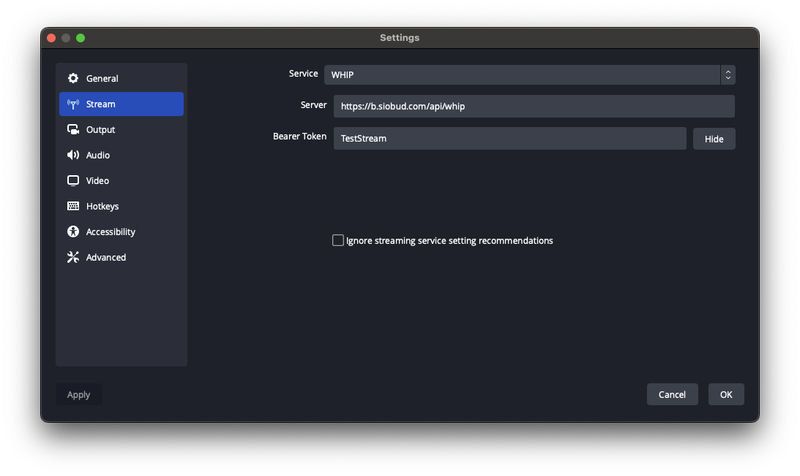
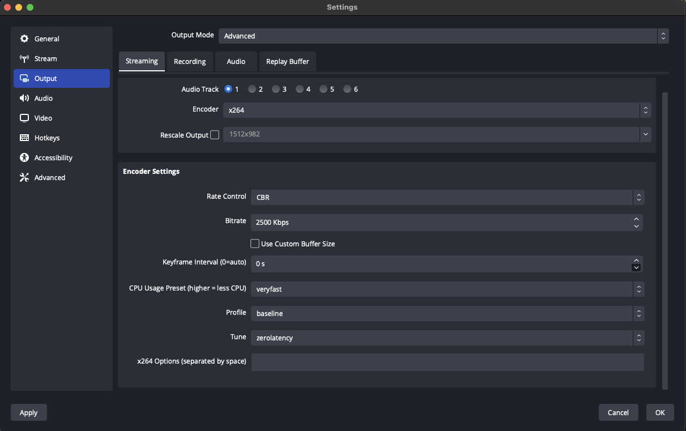
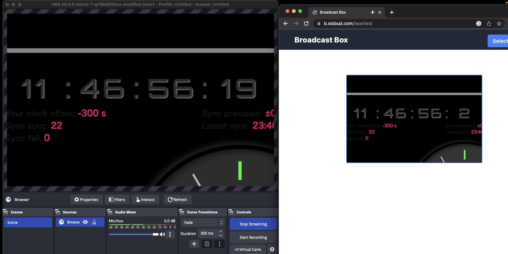
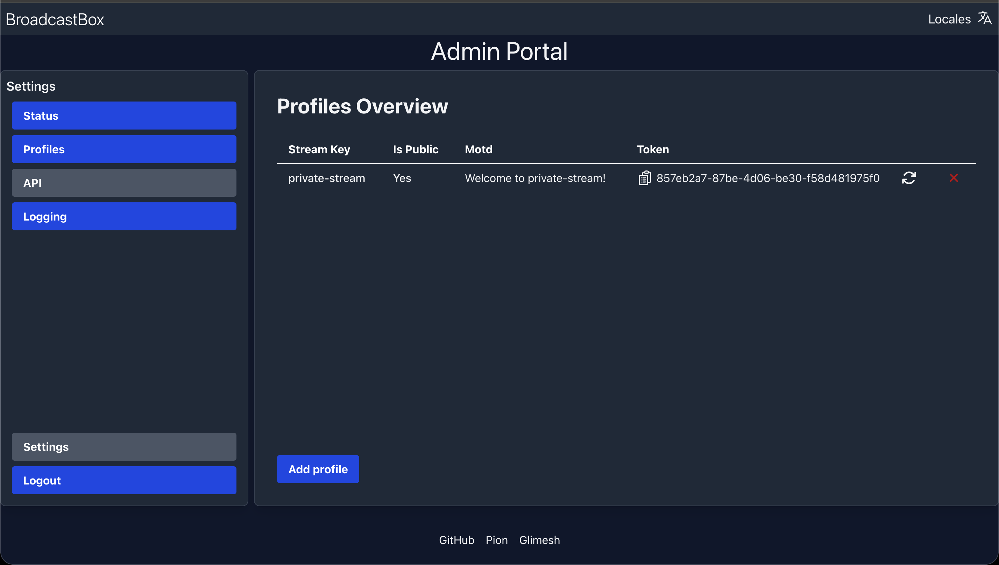
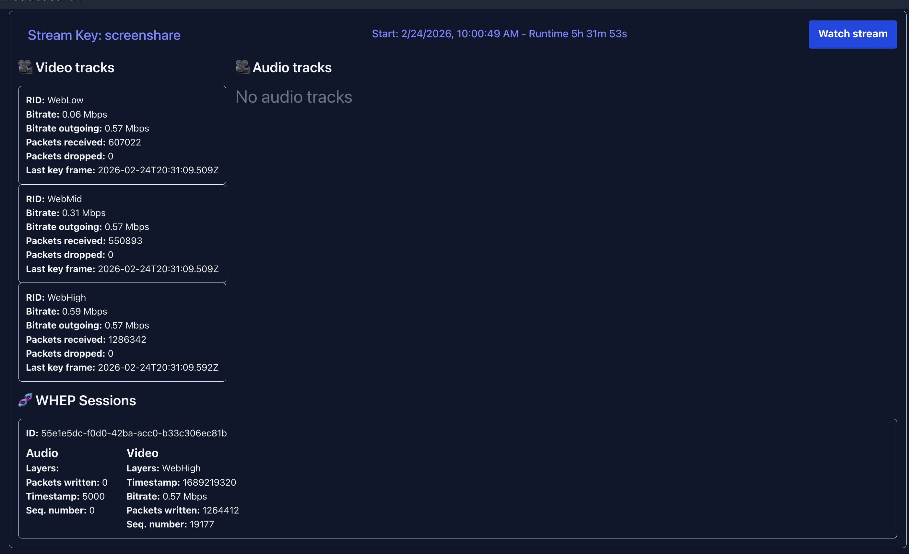

# Broadcast Box

[![License][license-image]][license-url]
[![Discord][discord-image]][discord-invite-url]

- [What is Broadcast Box](#what-is-broadcast-box)
- [Using](#using)
  - [OBS Broadcasting](#obs-broadcasting)
  - [Browser Publishing](#browser-publishing)
  - [FFmpeg Broadcasting](#ffmpeg-broadcasting)
  - [GStreamer Broadcasting](#gstreamer-broadcasting)
  - [Playback](#playback)
  - [Admin Portal](#admin-portal)
  - [Statistics](#statistics)
  - [Examples](#examples)
- [Getting Started](#getting-started)
  - [Configuring](#configuring)
  - [Building From Source](#building-from-source)
  - [Frontend](#frontend)
  - [Backend](#backend)
  - [Docker](#docker)
  - [Docker Compose](#docker-compose)
- [URL Parameters](#url-parameters)
- [Environment Variables](#environment-variables)
- [CLI Flags](#cli-flags)
- [Stream Profile Policy](#stream-profile-policy)
- [Webhooks](#webhooks)
- [Network Test on Start](#network-test-on-start)
- [Design](#design)

## What is Broadcast Box

Broadcast Box lets you broadcast/screen-share to friends in sub-second time. It was designed
to be simple to use and easily modifiable. Broadcast Box uses WebRTC, to learn more see
the OBS [WHIP Streaming Guide](https://obsproject.com/kb/whip-streaming-guide)

Want to contribute to the development of Broadcast Box? See [Contributing](./CONTRIBUTING.md).

## Using

A public instance of Broadcast Box is hosted at [b.siobud.com](https://b.siobud.com). Feel free to use this as
much as you want. Go to [Getting Started](#getting-started) for instructions on running it locally.

### OBS Broadcasting

To use Broadcast Box with OBS you must set your output to WebRTC and set a proper URL + Stream Key.
You may use any Stream Key you like. The same stream key is used for broadcasting and playback.

Go to `Settings -> Stream` and set the following values.

- Service: WHIP
- Server: <https://b.siobud.com/api/whip>
- StreamKey: (Any Stream Key you like)

Your settings page should look like this:



OBS by default will have ~2 seconds of latency. If you want sub-second latency you can configure
this in `Settings -> Output`. Set your encoder to `x264` and set tune to `zerolatency`. Your Output
page will look like this.



When you are ready to broadcast press `Start Streaming` and now time to watch!

### Browser Publishing

Open `/publish/<streamKey>` (for example <https://b.siobud.com/publish/StreamTest>) to publish directly from the browser.
Broadcast Box can capture either your screen or webcam and uses the same stream key for playback.

If the supplied bearer token belongs to a reserved profile, the page also exposes profile settings so you can update
the stream MOTD and toggle public/private visibility without leaving the publish flow.

### FFmpeg Broadcasting
The following broadcasts a test feed to https://b.siobud.com with a Bearer Token of `ffmpeg-test`

```shell
ffmpeg \
  -re \
  -f lavfi -i testsrc=size=1280x720 \
  -f lavfi -i sine=frequency=440 \
  -pix_fmt yuv420p -vcodec libx264 -profile:v baseline -r 25 -g 50 \
  -acodec libopus -ar 48000 -ac 2 \
  -f whip -authorization "ffmpeg-test" \
  "https://b.siobud.com/api/whip"
```

> Note that WHIP support and libx264 are required for this example. WHIP was added in version 8 of FFmpeg.

### GStreamer Broadcasting

See the example script [here](examples/gstreamer-broadcast.sh).

Can broadcast gstreamer's test sources, or pulsesrc+v4l2src

Expects `gstreamer-1.0`, with `good,bad,ugly` plugins and `gst-plugins-rs`

Use of example scripts:

```shell
# testsrcs
./examples/gstreamer-broadcast.sh http://localhost:8080/api/whip testStream1
# v4l2src
./examples/gstreamer-broadcast.sh http://localhost:8080/api/whip testStream1 v4l2
```

### Playback

If you are broadcasting to the Stream Key `StreamTest` your video will be available at <https://b.siobud.com/StreamTest>.

The player page also supports multi-view playback. Use the `Add Stream` button in the footer to add more active streams
to the same page, and use `?cinemaMode=true` to open the player in a chrome-free layout.

You can also go to the home page and enter `StreamTest`. The following is a screenshot of OBS broadcasting and
the latency of 120 milliseconds observed.



### Admin Portal

When `FRONTEND_ADMIN_TOKEN` is set Broadcast Box provides an Admin Portal at `/admin`. The same token is used to log in.

The current Admin Portal exposes:

- `Status` to inspect active publishers/subscribers and metadata
- `Profiles` to create stream profiles, rotate tokens, and remove profiles
- `Logging` to read the current server log file

Stream Profiles let you reserve a stream key, so only authorized users can stream to that key.



### Statistics

Viewable at `/statistics`, this page shows stream uptime, track metrics, and WHEP session details.

This page relies on `/api/status`, so disabling the status API disables statistics.



### Examples

The repository includes a few small examples and integration helpers:

- [examples/simple-watcher.html](./examples/simple-watcher.html) - minimal WHEP viewer with no framework dependencies
- [examples/dynamic-watcher.html](./examples/dynamic-watcher.html) - polls `/api/status` and opens viewers for all active streams
- [examples/gstreamer-broadcast.sh](./examples/gstreamer-broadcast.sh) - publishes a stream with GStreamer
- [examples/gstreamer-whep-to-rtmp.sh](./examples/gstreamer-whep-to-rtmp.sh) - subscribes over WHEP and republishes to RTMP with GStreamer
- [examples/webhook-server/main.go](./examples/webhook-server/main.go) - simple webhook authorization server
- [examples/recording/main.go](./examples/recording/main.go) - webhook-driven recorder that writes `.ogg` and `.h264` files

## Getting Started

Broadcast Box is made up of two parts. The server is written in Go and is in charge of ingesting and broadcasting WebRTC. The frontend is in react and connects to the Go backend. The Go server can be used to serve the HTML/CSS/JS directly. Use the following instructions to build from source or utilize [Docker](#docker) / [Docker Compose](#docker-compose).

### Configuring

The backend loads [.env.production](./.env.production) by default. Set `APP_ENV=development` to load
[.env.development](./.env.development) instead.

If you only want the backend API or CLI helpers without serving the built frontend, set `DISABLE_FRONTEND=TRUE`.

### Building From Source

#### Frontend

React dependencies are installed by running `npm install` in the `web` directory.

- `npm run build` builds production assets into `web/build`
- `npm start` runs the Vite dev server and proxies `/api` to the backend
- `npm run host` runs the same Vite dev server on your local network

If everything is successful, you should see output similar to:

```console
> broadcast-box@0.1.0 build
> vite build

[dotenv@17.2.3] injecting env (0) from ../.env.development,../.env -- tip: ⚙️  load multiple .env files with { path: ['.env.local', '.env'] }
Target Backend: http://localhost:8080
vite v6.4.1 building for production...
✓ 724 modules transformed.
build/index.html                       0.84 kB │ gzip:  0.49 kB
build/assets/index-BZVYZNKC.css       20.37 kB │ gzip:  4.82 kB
build/assets/index-BeQC1JnS.js         1.43 kB │ gzip:  0.69 kB
build/assets/components-BcOZaJ_1.js   63.11 kB │ gzip: 16.08 kB
build/assets/node-DpLsG32O.js        239.39 kB │ gzip: 75.76 kB
✓ built in 601ms
```

#### Backend

Go dependencies are automatically installed.

To run the Go server, run `go run .` in the root of this project, you should see the following:

```console
2026/02/24 12:00:00 Environment: Loading `.env.production`
2026/02/24 12:00:00 Starting HTTP server at :8080
```

To use Broadcast Box navigate to: `http://<YOUR_IP>:8080`. In your broadcast tool of choice, you will broadcast to `http://<YOUR_IP>:8080/api/whip`.

### Docker

A Docker image is also provided to make it easier to run locally and in production. The arguments you run the Dockerfile with depending on
if you are using it locally or a server.

If you want to run locally execute `docker run -e UDP_MUX_PORT=8080 -e NAT_1_TO_1_IP=127.0.0.1 -p 8080:8080 -p 8080:8080/udp seaduboi/broadcast-box`.
This will make broadcast-box available on `http://localhost:8080`. The UDPMux is needed because Docker on macOS/Windows runs inside a NAT.

If you are running on AWS (or other cloud providers) execute. `docker run --net=host -e INCLUDE_PUBLIC_IP_IN_NAT_1_TO_1_IP=yes seaduboi/broadcast-box`
broadcast-box needs to be run in net=host mode. broadcast-box listens on random UDP ports to establish sessions.

### Docker Compose

A Docker Compose is included that uses LetsEncrypt for automated HTTPS. It also includes Watchtower so your instance of Broadcast Box
will be automatically updated every night. If you are running on a VPS/Cloud server this is the quickest/easiest way to get started.

```console
export URL=my-server.com
docker-compose up -d
```

## URL Parameters

The frontend can be configured by passing these URL Parameters.

- `cinemaMode=true` - Forces the player into cinema mode by adding to end of URL like https://b.siobud.com/myStream?cinemaMode=true

## Environment Variables

### Server Configuration

| Variable                | Description                                                                                                  |
| ----------------------- | ------------------------------------------------------------------------------------------------------------ |
| `APP_ENV`               | Set to `development` to load `.env.development` instead of `.env.production`.                                |
| `HTTP_ADDRESS`          | Address for the main server to bind to. Used for HTTP, or HTTPS when certificates are configured.            |
| `ENABLE_HTTP_REDIRECT`  | When set, enables automatic redirection from HTTP to HTTPS.                                                  |
| `HTTPS_REDIRECT_PORT`   | Port to listen on for the HTTP-to-HTTPS redirect server.                                                     |
| `NETWORK_TEST_ON_START` | If `true`, checks network connectivity on startup.                                                           |
| `DISABLE_STATUS`        | When set, disables `/api/status`. Stream discovery and `/statistics` rely on this endpoint.                  |
| `ENABLE_PROFILING`      | If `true`, enables PPROF profiling on `localhost:6060`.                                                      |

### SSL Configuration

| Variable   | Description                                                                                     |
| ---------- | ----------------------------------------------------------------------------------------------- |
| `SSL_CERT` | Path to the SSL certificate file. When set together with `SSL_KEY`, the Go server serves HTTPS. |
| `SSL_KEY`  | Path to the SSL key file. When set together with `SSL_CERT`, the Go server serves HTTPS.       |

### Authorization & Profiles

| Variable                | Description                                                                                                                               |
| ----------------------- | ----------------------------------------------------------------------------------------------------------------------------------------- |
| `STREAM_PROFILE_PATH`   | Path to store stream profile configurations. Default is `profiles`.                                                                       |
| `STREAM_PROFILE_POLICY` | Policy configuration for local reserved profiles. Default is `ANYONE_WITH_RESERVED`. See [Stream Profile Policy](#stream-profile-policy). |
| `WEBHOOK_URL`           | URL for a webhook backend used to authorize/log publish (`WHIP`) and subscribe (`WHEP`) requests. See [Webhooks](#webhooks).            |

### Frontend Configuration

| Variable               | Description                                                                               |
| ---------------------- | ----------------------------------------------------------------------------------------- |
| `DISABLE_FRONTEND`     | Disables frontend asset serving and UI routes (`/`, `/publish`, `/statistics`, `/admin`). |
| `FRONTEND_PATH`        | Path to built frontend assets. Defaults to `./web/build`.                                 |
| `FRONTEND_ADMIN_TOKEN` | Enables `/admin` and defines the bearer token required to log in.                         |

### WebRTC & Networking

| Variable                             | Description                                                               |
| ------------------------------------ | ------------------------------------------------------------------------- |
| `INCLUDE_PUBLIC_IP_IN_NAT_1_TO_1_IP` | Automatically includes public IPs in NAT configuration.                   |
| `NAT_1_TO_1_IP`                      | Manually specify IPs (like Public IP) to announce, delineated by `\|`     |
| `INTERFACE_FILTER`                   | Restrict UDP traffic to a specific network interface.                     |
| `NAT_ICE_CANDIDATE_TYPE`             | Set to `srflx` to append IPs instead of overriding with `NAT_1_TO_1_IP`.  |
| `NETWORK_TYPES`                      | List of network types to use delineated by `\|` (e.g.,`udp4 \|udp6`).     |
| `INCLUDE_LOOPBACK_CANDIDATE`         | Enables WebRTC traffic on loopback interface.                             |
| `UDP_MUX_PORT`                       | Port to multiplex all UDP traffic. Uses random port by default.           |
| `UDP_MUX_PORT_WHEP`                  | Port to multiplex WHEP traffic only.                                      |
| `UDP_MUX_PORT_WHIP`                  | Port to multiplex WHIP traffic only.                                      |
| `TCP_MUX_ADDRESS`                    | Address to serve WebRTC traffic over TCP.                                 |
| `TCP_MUX_FORCE`                      | Forces WebRTC traffic to use TCP only.                                    |
| `APPEND_CANDIDATE`                   | Appends ICE candidates not generated by the agent.                        |

### STUN Servers

| Variable       | Description                             |
| -------------- | --------------------------------------- |
| `STUN_SERVERS` | List of STUN servers separated by `\|`. |

These values are parsed by the Go backend and applied to WHIP/WHEP `PeerConnection` configuration server-side. Clients do not fetch ICE server configuration from an API endpoint.

### Debugging

| Variable                     | Description                                 |
| ---------------------------- | ------------------------------------------- |
| `DEBUG_PRINT_OFFER`          | Prints WebRTC offers received from clients. |
| `DEBUG_PRINT_ANSWER`         | Prints WebRTC answers sent to clients.      |
| `DEBUG_INCOMING_API_REQUEST` | Logs incoming API request paths.            |
| `DEBUG_PRINT_SSE_MESSAGES`   | Logs Server-Sent Events messages.           |

### Logging

| Variable                      | Description                                                                                               |
| ----------------------------- | --------------------------------------------------------------------------------------------------------- |
| `LOGGING_ENABLED`             | Enables logging system.                                                                                   |
| `LOGGING_DIRECTORY`           | Directory to store log files.                                                                             |
| `LOGGING_SINGLEFILE`          | Logs everything into a single file called 'log'. Default is log files are stamped with current date.     |
| `LOGGING_NEW_FILE_ON_STARTUP` | Creates a new log file on each startup. Either a new 'log' file, or replaces the current dates log file. |
| `LOGGING_API_ENABLED`         | Enables logging API to show current log entries on the backend. `/api/log`                                |
| `LOGGING_API_KEY`             | When set, the logging API requires a bearer token that uses this key.                                     |

### Chat

| Variable                | Description                                                    |
| ----------------------- | -------------------------------------------------------------- |
| `CHAT_MAX_HISTORY`      | Maximum number of chat messages retained per stream in memory. |
| `CHAT_DEFAULT_TTL`      | How long idle chat sessions stay alive before they expire.     |
| `CHAT_CLEANUP_INTERVAL` | How often expired chat sessions are cleaned up.                |

Broadcast Box attaches a WebRTC data channel (`bb-chat-v1`) to WHIP/WHEP peer connections for simple per-stream
chat state. The bundled frontend does not currently expose a chat UI, but you can connect from your own client.

See [CONNECTING.md](internal/chat/CONNECTING.md) for the message contract and a minimal standalone client example.

## CLI Flags

The binary also supports a small local profile-management helper:

- `-createNewProfile -streamKey <stream-key>` creates a new reserved profile in `STREAM_PROFILE_PATH`, prints the bearer token, and exits

Example:

```shell
go run . -createNewProfile -streamKey MyStream
```

## Stream Profile Policy

The `STREAM_PROFILE_POLICY` environment variable controls who is allowed to initiate streaming sessions based on profile reservation status.

| Value                  | Description                                                                                                         |
| ---------------------- | ------------------------------------------------------------------------------------------------------------------- |
| `ANYONE_WITH_RESERVED` | Reserved stream keys require a valid token. Unreserved stream keys may still be used by anyone.                    |
| `RESERVED`             | Only users with a valid token **and** a reserved stream key are allowed to stream. This is the most restrictive mode. |

Any other value currently falls back to `ANYONE_WITH_RESERVED` behavior.

## Webhooks

When `WEBHOOK_URL` is set Broadcast Box sends a webhook for every publish and subscribe. If this webhook is rejected the video session is disconnected.

The webhook payload includes:

- `action` (`whip-connect` for publishers, `whep-connect` for viewers)
- `bearerToken`
- `queryParams`
- `ip`
- `userAgent`

The webhook must return HTTP `200 OK` with a JSON body like `{ "streamKey": "YourResolvedStreamKey" }`.
Any other status code rejects the session.

This enables you to implement authorization or logging for broadcasting (WHIP) and subscribing (WHEP) independently.

See [here](examples/webhook-server/main.go). For an example Webhook Server that only allows the stream `broadcastBoxRulez`

For a more advanced example of a webhook server implementation making use of separating the key for streaming from the key for watching, see the [broadcastbox-webhookserver](https://github.com/chrisingenhaag/broadcastbox-webhookserver) repository.


## Network Test on Start

When running in Docker Broadcast Box runs a network tests on startup. This tests that WebRTC traffic can be established
against your server. If you server is misconfigured Broadcast Box will not start.

If the network test is enabled this will be printed on startup

```console
NETWORK_TEST_ON_START is enabled. If the test fails Broadcast Box will exit.
See the README.md for how to debug or disable NETWORK_TEST_ON_START
```

If the test passed you will see

```console
Network Test passed.
Have fun using Broadcast Box
```

If the test failed you will see the following. The middle sentence will change depending on the error.

```console
Network Test failed.
Network Test client reported nothing in 30 seconds
Please see the README and join Discord for help
```

[Join the Discord][discord-invite-url] and we are ready to help! To debug check the following.

- Have you allowed UDP traffic?
- Do you have any restrictions on ports?
- Is your server publicly accessible?

If you wish to disable the test set the environment variable `NETWORK_TEST_ON_START` to false.

## Design

The backend exposes the following endpoints to support WebRTC streaming and server-side monitoring:

| Endpoint                             | Description                                                                                                                            |
| ------------------------------------ | -------------------------------------------------------------------------------------------------------------------------------------- |
| `/api/whip`                          | Initiates a WHIP session for broadcasting via WebRTC. Requires an `Authorization: Bearer <token>` header.                              |
| `/api/whip/{sessionID}`              | `PATCH` handles WHIP trickle ICE for an existing session and `DELETE` closes it. Requires the same bearer token.                       |
| `/api/whip/profile`                  | `GET`/`POST` endpoint for reading or updating the reserved profile (MOTD/privacy) associated with the supplied bearer token.           |
| `/api/whep`                          | Initiates a WHEP session for playback via WebRTC. Requires an `Authorization: Bearer <streamKey>` header.                              |
| `/api/whep/{sessionID}`              | `PATCH` handles WHEP trickle ICE for an existing playback session.                                                                     |
| `/api/sse/{sessionID}`               | Server-sent events for stream status and available layers.                                                                             |
| `/api/layer/{sessionID}`             | Switches audio/video layers for a WHEP session.                                                                                        |
| `/api/status`                        | Returns the status of all active public WHIP streams. Pass `?key=<streamKey>` to fetch one active stream by key.                       |
| `/api/log`                           | Returns the current log file when `LOGGING_API_ENABLED=TRUE`. If `LOGGING_API_KEY` is set, this endpoint also requires a bearer token. |
| `/api/admin/login`                   | Validates the admin bearer token configured in `FRONTEND_ADMIN_TOKEN`.                                                                 |
| `/api/admin/status`                  | Returns full session state for the admin UI, including private streams.                                                                |
| `/api/admin/profiles`                | Lists configured stream profiles for the admin UI.                                                                                     |
| `/api/admin/profiles/add-profile`    | Creates a new stream profile.                                                                                                          |
| `/api/admin/profiles/remove-profile` | Removes an existing stream profile.                                                                                                    |
| `/api/admin/profiles/reset-token`    | Rotates the token for an existing stream profile.                                                                                      |
| `/api/admin/logging`                 | Returns the current log file for the admin UI.                                                                                         |

All `/api/admin/*` endpoints require the `FRONTEND_ADMIN_TOKEN` bearer token.

The frontend ships the following browser routes:

| Route                  | Description                                                                                   |
| ---------------------- | --------------------------------------------------------------------------------------------- |
| `/`                    | Home page for joining an existing stream or navigating to browser publishing.                 |
| `/publish/{streamKey}` | Browser publisher for screen/webcam streaming and reserved profile settings.                  |
| `/statistics`          | Live stream and subscriber statistics derived from `/api/status`.                             |
| `/admin`               | Admin portal for status, profiles, and log viewing when `FRONTEND_ADMIN_TOKEN` is set.        |
| `/{streamKey}`         | Player page for a stream. The built-in UI can add more streams to create a multi-view layout. |

[license-image]: https://img.shields.io/badge/License-MIT-yellow.svg
[license-url]: https://opensource.org/licenses/MIT
[discord-image]: https://img.shields.io/discord/1162823780708651018?logo=discord
[discord-invite-url]: https://discord.gg/An5jjhNUE3
